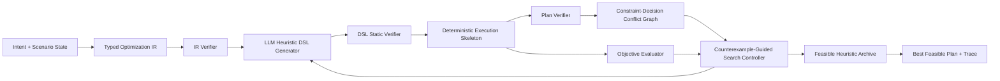

# 系统设计与方法论方案：COVER-Opt

> 版本：v2.0，2026-08-25 复审版  
> 状态：系统原型已完成；v1.3 受控实验为完整负结果，v1.4 扩大验证已暂停  
> 原 VHR-Opt 方案保留的思想：external verifier、evaluate-and-refine、候选档案  
> 本次强化：有类型启发式 DSL、确定性执行骨架、约束-决策冲突图、反例驱动定向修复

## 0. 方法定位

推荐名称：

```text
COVER-Opt: Constraint-Verified Operator Evolution and Counterexample-Guided Repair
for Dynamic Microservice Deployment in Space Computing Power Networks
```

中文：

```text
面向动态空间算力网络微服务部署的约束验证算子演化与反例修复方法
```

核心定位：

```text
LLM 不直接给出可信部署结果，也不生成任意 Python 求解器。
LLM 在受限 DSL 中生成或修改部署启发式算子；确定性执行骨架构造方案；
验证器输出约束-决策冲突图；搜索控制器利用失败场景和冲突定位，
只修改相关启发式子结构，形成可验证、可复现、可消融的求解闭环。
```

原论文中的自然语言建模、`P/V/C/O` 提取、solver code generation 和错误反馈仍然保留，但作为前端能力与复现基线，不再承担新版主要创新。

## 1. 研究论证链

### 1.1 一句话问题

在链路随时间变化、节点资源异构且部署具有硬约束的 Space-CPN 中，如何让 LLM 帮助发现高质量微服务部署启发式，同时避免直接生成方案或代码带来的不可行、不可复现和性能归因不清问题？

### 1.2 一句话 gap

现有 LLM 优化方法已经覆盖自然语言建模、solver-in-the-loop、启发式演化、可行性修复和动态启发式库，但仍缺少一种面向耦合部署/路由约束的受限算子表示，以及将具体失败决策映射回启发式子结构的定向反例修复机制。

### 1.3 一句话 insight

如果把搜索对象从“完整方案/任意代码”缩小为有类型启发式算子，并把 verifier 的输出从自然语言错误升级为“约束-决策冲突图”，就可以在保持确定性可行性检查的同时，让 LLM 只探索最需要修改的局部规则。

### 1.4 机制链

```text
受限 DSL
  -> 降低语法和接口错误，支持静态验证与结构距离计算
确定性执行骨架 + feasible mask
  -> 将节点资格和局部容量等约束尽量前置到构造过程
约束-决策冲突图
  -> 识别哪些服务、节点、路径和启发式组件导致失败
counterexample replay + targeted mutation
  -> 在固定搜索预算下减少无关重写，提高修复效率
跨场景确定性评估
  -> 把可行性、质量、时间和 LLM 成本分开测量
```

## 2. 动态部署问题定义

### 2.1 时刻状态

在时隙 `t`，问题实例写为：

```text
I_t = (G_t, S, A, Q_t, X_{t-1})
```

- `G_t=(D,E_t)`：当前卫星节点和可用链路。
- `D`：卫星集合，每个节点具有 CPU、memory、compute rate 等资源。
- `E_t`：时变链路，具有传播时延、传输速率、带宽和可用窗口。
- `S`：微服务集合，具有资源需求、处理工作量和可部署节点集合。
- `A`：服务 DAG 的依赖边及数据量。
- `Q_t`：当前请求、QoS 阈值和目标偏好。
- `X_{t-1}`：上一时隙部署，用于计算迁移代价。

### 2.2 输出

输出部署与路由计划：

```text
Pi_t = (X_t, R_t)
```

- `X_t`：微服务到卫星的部署映射。
- `R_t`：每条服务依赖在卫星图上的路由路径。

首版实现采用“部署决策 + 确定性路径选择”的分解方式：启发式决定服务顺序和目标节点，执行骨架从可行路径集合中选择路径。后续只有在消融证明必要时，才升级为联合算子演化。

### 2.3 硬约束

1. 每个微服务恰好部署一次。
2. 部署节点属于该服务的可部署集合。
3. 节点各资源维度不超容量。
4. 每条服务依赖存在可用路径。
5. 路径带宽和可用窗口满足数据传输需求。
6. 端到端 QoS 不超过阈值。
7. 动态重部署时不超过迁移预算或迁移窗口。

硬约束不混入普通加权目标。任何违反硬约束的计划都不能因目标值较低而进入可行精英集。

### 2.4 软目标

对可行计划，评价：

```text
J_t(Pi_t) = w_l * latency(Pi_t)
          + w_b * load_imbalance(Pi_t)
          + w_m * migration_cost(X_{t-1}, X_t)
          + w_e * energy_proxy(Pi_t)
```

首轮主实验以 latency 和 migration cost 为主，load balance 为次要指标；energy 只有在参数来源可解释时启用。避免在没有数据支撑时堆叠过多目标。

## 3. 总体架构



系统分成确定性与非确定性两部分：

- 非确定性：LLM 生成或修改 DSL 候选。
- 确定性：IR 校验、DSL 静态检查、执行骨架、路径搜索、约束验证、目标计算、档案更新和实验统计。

每次 LLM 调用、提示、原始响应、解析结果、验证报告和评分都持久化，支持离线 replay。

## 4. Typed Optimization IR

IR 只负责稳定表达问题，不作为主要创新点。它必须覆盖：

```json
{
  "scenario_id": "walker_48_slot_000",
  "time_slot": 0,
  "nodes": [],
  "links": [],
  "services": [],
  "service_edges": [],
  "previous_placement": {},
  "hard_constraints": [
    "unique_placement",
    "node_eligibility",
    "node_capacity",
    "route_connectivity",
    "link_bandwidth",
    "qos_latency",
    "migration_budget"
  ],
  "objective": {
    "latency": 1.0,
    "load_imbalance": 0.0,
    "migration_cost": 0.2
  }
}
```

自然语言解析实验与优化实验分开：

- `canonical IR -> solver` 用于评价求解方法。
- `natural language -> IR` 用于评价建模正确率。

这样可以防止自然语言解析错误污染求解性能归因。

## 5. 有类型启发式 DSL

### 5.1 为什么不用任意 Python

任意代码生成会引入未验证边界、错误循环、危险调用和长尾正确性下降。COVER-Opt 只允许 LLM 组合有限操作与特征，不允许 import、文件访问、网络调用和任意 `eval/exec`。

### 5.2 DSL 组成

一个启发式程序包含四个可独立消融的组件：

1. `service_order`：决定服务处理顺序。
2. `node_score`：对当前可部署节点评分。
3. `path_score`：对候选路径评分。
4. `repair_policy`：在局部失败时执行 move/swap/reroute/backtrack。

示例：

```json
{
  "version": "1.0",
  "service_order": {
    "op": "weighted_sum",
    "terms": [
      {"feature": "critical_path_rank", "weight": 0.6},
      {"feature": "resource_demand_ratio", "weight": 0.4}
    ],
    "direction": "descending"
  },
  "node_score": {
    "op": "weighted_sum",
    "terms": [
      {"feature": "residual_compute_ratio", "weight": 0.35},
      {"feature": "dependency_latency", "weight": -0.45},
      {"feature": "predicted_contact_duration", "weight": 0.20}
    ]
  },
  "path_score": {
    "op": "weighted_sum",
    "terms": [
      {"feature": "path_latency", "weight": -0.7},
      {"feature": "bottleneck_bandwidth", "weight": 0.3}
    ]
  },
  "repair_policy": ["reroute", "move_bottleneck_service", "bounded_backtrack"]
}
```

### 5.3 静态验证

静态验证检查：

- schema 与版本是否合法。
- 特征、算子和 repair action 是否在白名单。
- 权重是否为有限数值。
- 每个评分规则的项数和 repair action 数是否超过预算。
- 是否引用当前问题未提供的特征。
- 是否出现恒定表达式、空规则或重复无效项。

只有静态验证通过的 DSL 才进入执行与仿真。

## 6. 确定性执行骨架

执行骨架 `A(h, I_t)` 将启发式 `h` 转为计划 `Pi_t`：

```text
1. 按 service_order 对服务做兼容 DAG 的优先级排序。
2. 对当前服务生成 eligible node mask。
3. 移除容量不足或违反部署资格的节点。
4. 用 node_score 排序候选节点。
5. 对依赖边生成 K 条候选路径并执行连通性、接触窗口和共享带宽 mask。
6. 用 path_score 选择路径，并按时隙平均需求扣减物理链路剩余带宽。
7. 若局部失败，按 repair_policy 执行有界修复。
8. 返回完整计划或结构化失败状态。
```

能够 by construction 保证的范围：

- 节点资格。
- 已分配服务的局部资源容量。
- 已选路径的连通性和当前带宽。

仍需全局 verifier 检查的范围：

- 多前驱服务的端到端时延。
- 完整计划中的共享带宽聚合复核。
- QoS、迁移预算和跨时隙连续性。

因此不能在实验前声称“100% guaranteed feasibility”。

## 7. 验证器与约束-决策冲突图

### 7.1 三层验证

1. `IRVerifier`：实体绑定、维度、必需约束和目标一致性。
2. `DSLVerifier`：语法、类型、安全和复杂度。
3. `PlanVerifier`：部署、资源、路径、QoS 和迁移硬约束。

`PlanVerifier` 输出统一 violation：

```json
{
  "constraint": "node_capacity.cpu",
  "severity": "hard",
  "magnitude": 0.24,
  "decisions": [
    {"service": "s3", "node": "d8", "contribution": 0.62},
    {"service": "s7", "node": "d8", "contribution": 0.38}
  ],
  "attribution_method": "exact_resource_share",
  "related_dsl_components": ["service_order", "node_score", "repair_policy"]
}
```

### 7.2 冲突图

构建二部图：

```text
constraint nodes <-> decision nodes
```

- 约束节点：capacity、route、bandwidth、QoS、migration。
- 决策节点：`place(s,d)`、`route(a,p)`、`migrate(s,d1,d2)`。
- 边权：该决策对违规幅度的贡献。

每条 violation 同时声明归因口径：单一决策可用 `direct`，资源、流量和迁移事件可按实际份额精确分摊；当前无法严格拆解的 QoS 影响使用 `proxy_uniform`，不把代理权重包装成精确因果。

冲突图用于：

- 找到高严重度约束。
- 定位贡献最大的少量决策。
- 将失败映射到具体 DSL 组件、可修改评分特征和 repair action。
- 生成最小或近似最小的修复邻域，避免整段启发式重写。

首版不承诺严格 minimal unsat core；实现目标是可复现的 conflict localization，并通过人工构造用例验证定位正确性。

## 8. Counterexample-Guided Operator Evolution

### 8.1 候选档案

档案维护：

- `feasible_elite`：跨场景可行率优先、目标值较好的候选。
- `structural_diverse`：DSL AST 结构不同的可行候选。
- `repairable`：失败集中、冲突定位明确的候选。
- `rejected`：静态非法、执行异常或无修复价值的候选，仅保留轨迹。

候选适应度采用字典序：

```text
fitness(h) = (
  1 - feasible_rate(h),
  mean_objective_on_feasible_cases(h),
  p95_planning_time(h),
  llm_calls_and_tokens(h)
)
```

### 8.2 反例选择

每轮从候选失败实例中选择：

- 最高严重度冲突。
- 高频重复冲突。
- 曾经修复失败的 regression case。
- 在相同优先级下优先选择尚未被反复重放的模式。

反馈给 LLM 的不是完整原始日志，而是：父候选 DSL、场景摘要、冲突子图、目标差距，以及允许修改的组件、特征和 repair action。调度器会从候选档案中选择违规负担较低的可修复父候选，并记录反例、父候选、优先级与重放次数。

实现分为两层：

- **单次搜索内重访**：只有某反例至少经历一次修复失败后才能被重新调度；被 outcome gate 拒绝的子候选保留于轨迹，但失去后续扩展资格。
- **跨运行场景重放**：`CounterexampleCampaignStore` 保存完整场景、结构化反例、合格父 DSL 和来源运行；外层 campaign 在独立 `SearchController` 运行中重放高优先级失败场景，并将存储快照与重放轨迹一起落盘。

这里的“跨运行”指同一受控 campaign 内的多个独立求解运行，不声称已完成跨进程在线终身记忆服务。

### 8.3 定向变异

| 主要冲突 | 允许优先修改 |
|---|---|
| CPU/memory capacity | `service_order` 的资源项、`node_score` 的资源余量项、容量修复动作 |
| dependency latency/QoS | `service_order`, `node_score`, `path_score` |
| route/bandwidth | `path_score`, `repair_policy` |
| migration budget | `node_score` 中迁移特征、`repair_policy` |

LLM 在 refinement 阶段输出局部 `patch`；在可选初始化阶段可输出完整 typed DSL。两类输出均不包含任意代码，并经过 schema、静态验证、去重和统一 evaluator。

初始 DSL 生成调用与 Patch 生成调用进入同一 `total_llm_calls` 账本；后端错误或 schema 错误也占用一次调用预算。如果未额外配置总上限，系统默认以 Patch 调用上限作为总 LLM 上限，避免多起点绕过成本门禁。

### 8.4 终止条件

- 达到 LLM call budget。
- 达到 evaluator budget。
- 达到 wall-clock budget。

所有预算作为实验配置记录，不由模型自行改变。

## 9. 算法伪代码

```text
Algorithm COVER-Opt

Input:
  Scenario I
  LLM generator M
  Static verifier Vs
  Plan verifier Vp
  Evaluator E
  Search budgets K_call, K_eval

1. P <- HandcraftedInitial + ValidateAndDeduplicate(LLMInitialDSLs, K_call)
2. A <- empty archive
3. for h in P while evaluator budget remains:
4.     Pi <- ExecuteDeterministicSkeleton(h, I)
5.     report <- Vp.Verify(Pi, I)
6.     Archive(A, h, Pi, report, E)
7. current <- BestFeasible(A) or LowestBurdenRepairable(A)

8. while total-LLM/evaluator/time budget remains:
9.     if current is infeasible, replay is enabled, and a repair has failed:
10.        case <- SelectBoundedReplayCase(A)
11.        current <- SelectBestRepairableParent(A, case)
12.    feedback <- BuildFeatureAuthorizedFeedback(current)
13.    patch <- M.GenerateDSLMutation(feedback)
14.    child <- ApplyAndStaticallyVerify(current, patch, Vs)
15.    if child is invalid: record rejection; continue
16.    Pi <- ExecuteDeterministicSkeleton(child, I)
17.    report <- Vp.Verify(Pi, I)
18.    conflicts <- BuildConflictGraph(Pi, report, I)
19.    score <- E.EvaluateOnlyIfFeasible(Pi, report, I)
20.    ArchiveAndTrace(A, child, Pi, report, conflicts, score)
21.    current <- OutcomeGateOrRollback(current, child, A)

22. return BestFeasibleCandidate(A), FullTrace(A), SearchStatistics

Outer campaign (optional):
23. Persist failed Scenario + Counterexample + EligibleParentDSL
24. Select a bounded high-priority failed scenario
25. Start a new search run from the stored parent DSL
26. Persist replay outcome, budget ledger, and resolution state
```

## 10. 动态运行方式

在每个时隙：

1. 更新卫星位置、链路状态、请求和节点资源。
2. 将上一时隙部署作为 `previous_placement`。
3. 运行已发现的启发式或在预算允许时进行少量 refinement。
4. 验证新计划并计算迁移成本。
5. 若重规划失败，回退到上一可行计划或确定性 baseline。

当前场景合同已经包含 `time_slot`、链路可用窗口、`previous_placement` 和迁移预算，能够验证单时隙重规划语义；但完整 episode 调度、跨时隙服务连续性与失败回退尚未接入当前 SearchController。滚动时域和 packet-level 网络仿真均属于后续实验范围，不能表述为现有完整能力。

## 11. 可说明的性质与边界

可以说明：

- 搜索在有限调用、评估或时间预算下终止。
- 初始 DSL 生成与 Patch 生成共享总 LLM 调用上限，并分项记录。
- DSL 的语法、安全和类型检查是确定性的。
- eligible、节点容量、接触窗口与共享带宽 mask 对已执行动作提供构造期约束。
- 所有最终报告结果都经过同一个独立 PlanVerifier。
- 当前 exact enumeration 可在有限候选集合上计算参照；CP-SAT/MILP 交叉校验属于后续实验任务。

不能提前说明：

- 全局最优。
- 所有实例 100% 可行。
- LLM 一定优于人工启发式或 RL。
- 冲突图一定给出严格最小不可满足核。
- 动态场景具有实时生产可用性。

## 12. 贡献与证据契约

### Contribution 1：有类型 Space-CPN 部署启发式表示与执行骨架

新能力：把 LLM 搜索空间限制为服务排序、节点评分、路径评分和修复算子的可执行组合，并由确定性骨架应用约束 mask。

必须证据：

- 与 raw Python generation、direct plan generation 比较解析/执行成功率。
- DSL 静态验证单测和恶意/异常输入测试。
- 有/无 feasible mask 的可行率和搜索效率消融。

### Contribution 2：约束-决策冲突图驱动的反例修复

新机制：将 verifier 发现的约束违规映射到具体部署/路由决策、归因口径、DSL 特征与修复动作；在有界预算内重访失败修复状态，或在外层 campaign 中重放完整失败场景，再定向生成结构 Patch。

必须证据：

- 冲突定位人工标注测试集。
- generic text feedback 与 conflict-directed feedback 的修复成功率、调用数和目标改进对比。
- 去除 counterexample replay、去除 conflict/feature targeting 的消融。

### Contribution 3：可复现的动态部署求解证据包

新证据：在静态、小规模 oracle 和动态滚动时域中，统一比较原论文 pipeline、传统启发式、元启发式与 COVER-Opt，并报告性能、可行性、迁移和 LLM 成本。

必须证据：

- 多随机种子均值、方差或置信区间。
- 小规模 optimality gap。
- 动态 QoS、迁移和 replanning time。
- 完整消融、错误类型和负面案例。

## 13. 与原 GLOBECOM 论文的增量关系

原论文：

```text
Natural Language -> P/V/C/O -> Gurobi Code -> Tests -> Error Feedback -> Deployment
```

强化版：

```text
Canonical IR -> Typed Heuristic DSL -> Deterministic Execution
             -> Plan Verification -> Conflict Graph
             -> Counterexample-Guided DSL Patch Search
             -> Dynamic Deployment + Reproducible Evidence
```

原论文 pipeline 将作为 `CurrentPaper-SolverGen` baseline。新版要证明的不是“LLM 也能调用求解器”，而是：在不训练模型的前提下，受限算子搜索和冲突定向反馈能否以可控成本发现可行、可解释、可迁移的部署启发式。

## 14. 首版明确不做

- 大模型训练、SFT、LoRA、RLHF。
- 多智能体角色编排。
- RAG 作为贡献点。
- 任意 Python 代码执行。
- MCTS；先用受预算约束的档案式演化搜索。
- ns-3/Mininet 主仿真；先完成可复现的时隙化决策仿真。
- 未经实验支撑的实时、鲁棒、通用或最优性强结论。

详细实施顺序、目录和验收标准见 `../planning/05_工程实现任务计划.md`。
